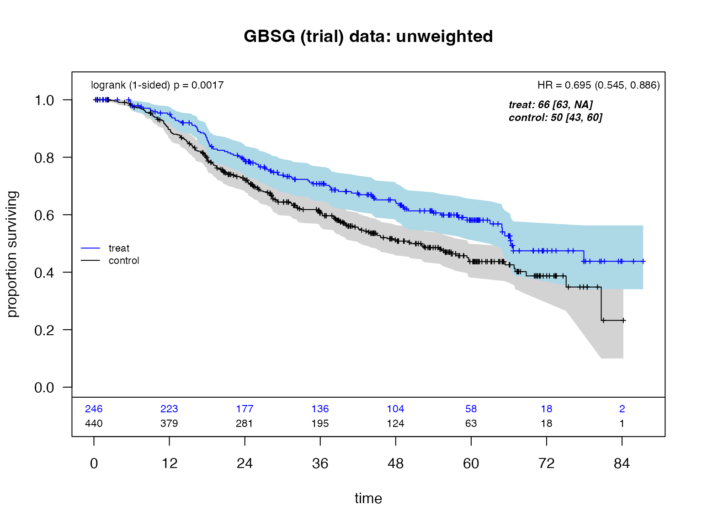
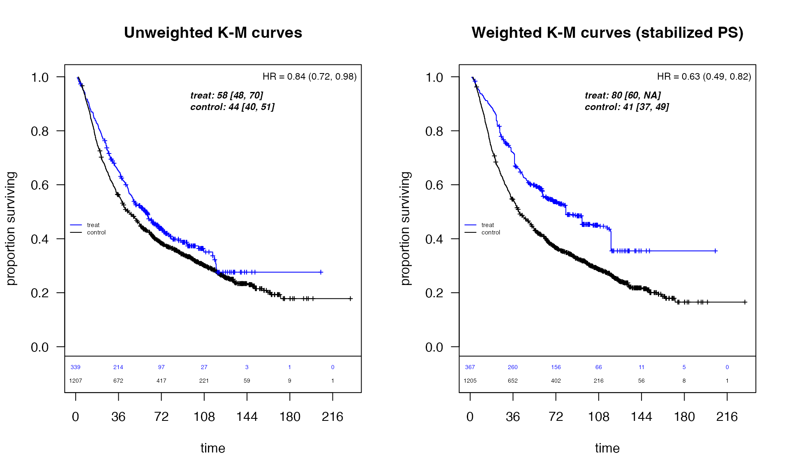
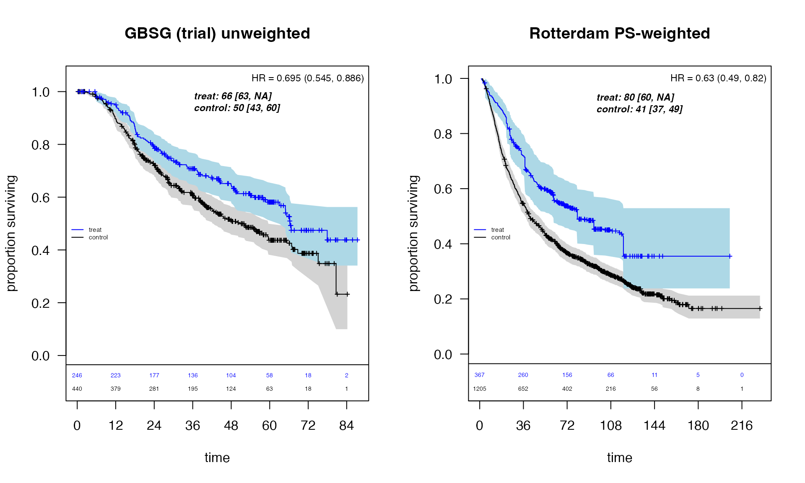
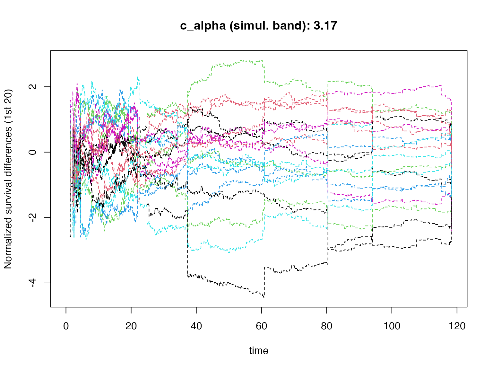
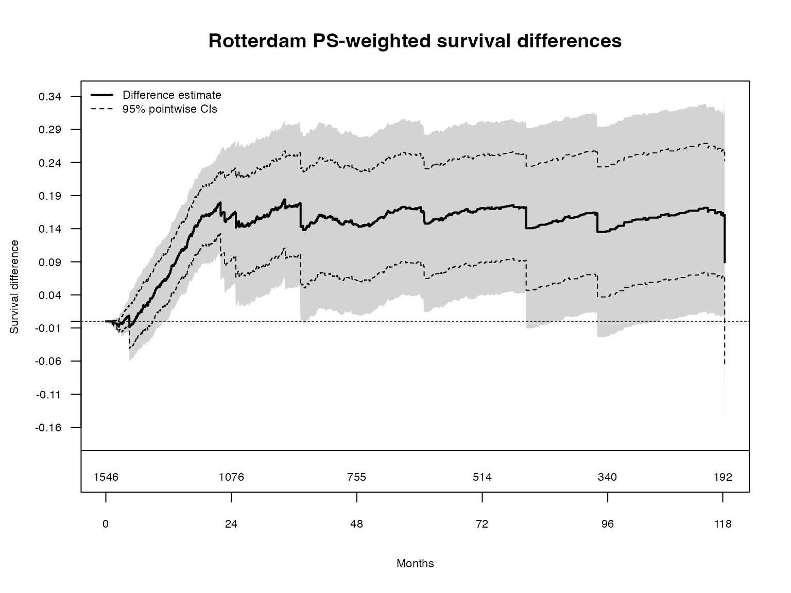
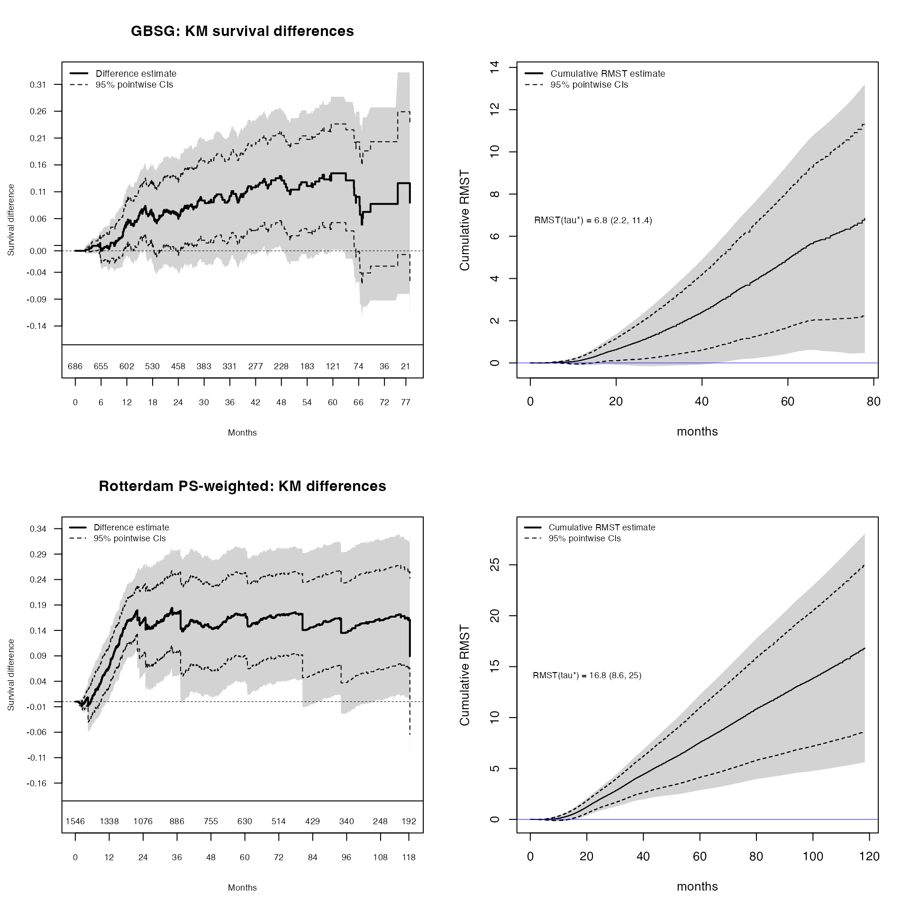

# Martingale Resampling Applications in Survival Analysis

``` r
knitr::opts_chunk$set(
  echo = TRUE, 
  message = FALSE, 
  warning = FALSE,
  fig.width = 10, 
  fig.height = 6
)
options(warn = -1)
library(survival)
library(ggplot2)
library(weightedsurv)
```

## Introduction

Martingale resampling (perturbation resampling) provides a powerful and
flexible approach to inference in survival analysis. While asymptotic
distributions are available for many common analysis methods,
resampling-based inference

- May have greater accuracy in small samples, and
- Extends to complex processes where asymptotics are not *readily*
  available (Dobler, Beyersmann, and Pauly 2017).

This vignette demonstrates martingale resampling applications in the
`weightedsurv` package using two breast cancer datasets:

1.  **GBSG** — a randomized clinical trial evaluating hormonal therapy
    (Schumacher et al. 1994).
2.  **Rotterdam** — an observational study where propensity-score
    weighting is used to adjust for confounding (Royston and Altman
    2013).

The examples include:

- Simultaneous confidence bands for survival (KM) arm differences
- Cumulative RMST curves with pointwise and simultaneous bands across
  follow-up (Zhao et al. 2016)
- Weighted analyses using propensity-score (IPTW) weights

## Brief Review of Counting Processes

We observe $`(X_{i,j}, \Delta_{i,j}, Z_{i,j})`$ where for subjects in
group $`j`$ ($`Z_i = j`$):

- $`X_i = \min(T_i, C_i)`$ and $`\Delta_i = I(T_i \leq C_i)`$
- The at-risk process: $`Y_{i,j}(t) = I(X_i \geq t, Z_i = j)`$
- The counting process:
  $`N_{i,j}(t) = I(X_i \leq t, \Delta_i = 1, Z_i = j)`$

The aggregate counting processes
$`\bar{N}_j(t) = \sum_{i=1}^{n_j} N_{i,j}(t)`$ count the observed events
through time $`t`$ for the control ($`j=0`$) and experimental ($`j=1`$)
arms.

### The Weighted Log-Rank Test

The weighted log-rank (WLR) statistic of class $`K^{+}`$ is

``` math
W_K = \int_0^{\infty} \left\{ \frac{K(t)}{\bar{Y}_0(t)} d\bar{N}_0(t) - \frac{K(t)}{\bar{Y}_1(t)} d\bar{N}_1(t) \right\}
= \int_0^{\infty} K(t)\, d\left\{\hat\Lambda_0(t) - \hat\Lambda_1(t)\right\},
```

where
$`K(t) = \sqrt{\frac{n_0 + n_1}{n_0 n_1}}\, w(t)\, \frac{\bar{Y}_0(t)\, \bar{Y}_1(t)}{\bar{Y}_0(t) + \bar{Y}_1(t)}`$
with Fleming–Harrington weights
$`w(t) = [\hat{\bar{F}}(t^{-})]^{\rho}[1 - \hat{\bar{F}}(t^{-})]^{\gamma}`$,
$`\rho \geq 0`$, $`\gamma \geq 0`$.

### Martingale Representation

Under the null, $`W_K`$ can be written as a sum of martingale integrals:

``` math
W_K = \sum_{i=1}^{n_0} \int_0^{\infty} \frac{K(t)}{\bar{Y}_0(t)}\, dN_{i,0}(t) - \sum_{i=1}^{n_1} \int_0^{\infty} \frac{K(t)}{\bar{Y}_1(t)}\, dN_{i,1}(t),
```

where the $`N_{i,j}(t)`$’s can be replaced by the corresponding
martingales
$`M_{i,j}(t) = N_{i,j}(t) - \int_0^t Y_{i,j}(s)\lambda_j(s)\,ds`$ under
the null.

### Resampling Recipe

The resampled statistic $`W^{\dagger}`$ is constructed as:

``` math
W^{\dagger} = \sum_{i=1}^{n_0} \int_0^{\infty} \left\{\frac{K(t)}{\bar{Y}_0(t)}\, dN_{i,0}(t)\right\} G_{i,0} - \sum_{i=1}^{n_1} \int_0^{\infty} \left\{\frac{K(t)}{\bar{Y}_1(t)}\, dN_{i,1}(t)\right\} G_{i,1},
```

where $`G_{i,j}`$ are $`n`$ i.i.d. $`N(0,1)`$ random variables. The
martingale increments $`dM_{i,j}`$ are represented by independent
standard normal random variables (independent of the data) that are
*multiplied* by the observable counting process increments $`dN_{i,j}`$,
with unknown parameters estimated by consistent estimators (Dobler,
Beyersmann, and Pauly 2017).

## GBSG Trial Data: Unweighted Analysis

### Data Preparation

We use the GBSG randomized trial data from the `survival` package,
converting follow-up from days to months.

``` r
df_gbsg <- gbsg
df_gbsg$tte <- df_gbsg$rfstime / 30.4375
df_gbsg$event <- df_gbsg$status
df_gbsg$treat <- df_gbsg$hormon
df_gbsg$grade3 <- ifelse(df_gbsg$grade == "3", 1, 0)

tte.name <- "tte"
event.name <- "event"
treat.name <- "treat"
arms <- c("treat", "control")
```

### Counting Process Summary and Log-Rank Test

The
[`df_counting()`](https://larry-leon.github.io/weightedsurv/reference/df_counting.md)
function prepares the survival data in counting-process format and
computes the standard log-rank test (Fleming–Harrington
$`\rho=0, \gamma=0`$), weighted log-rank statistics, and Cox model
results.

``` r
dfcount_gbsg <- df_counting(
  df = df_gbsg, 
  tte.name = tte.name, 
  event.name = event.name, 
  treat.name = treat.name, 
  arms = arms, 
  by.risk = 12, 
  scheme = "fh", 
  scheme_params = list(rho = 0, gamma = 0), 
  lr.digits = 4, 
  cox.digits = 3
)
```

### Kaplan-Meier Curves

``` r
plot_weighted_km(
  dfcount = dfcount_gbsg, 
  conf.int = TRUE, 
  show.logrank = TRUE, 
  ymax = 1.05, 
  xmed.fraction = 0.725
)
title(main = "GBSG (trial) data: unweighted")
```



## Rotterdam Observational Data: Propensity-Score Weighted Analysis

### Data Preparation and Propensity Score Estimation

The Rotterdam dataset is observational, so we use inverse probability of
treatment weighting (IPTW) with stabilized propensity-score weights to
adjust for confounding.

``` r
gbsg_validate <- within(rotterdam, {
  rfstime <- ifelse(recur == 1, rtime, dtime)
  t_months <- rfstime / 30.4375
  time_months <- t_months
  status <- pmax(recur, death)
  ignore <- (recur == 0 & death == 1 & rtime < dtime)
  status2 <- ifelse(recur == 1 | ignore, recur, death)
  rfstime2 <- ifelse(recur == 1 | ignore, rtime, dtime)
  time_months2 <- rfstime2 / 30.4375
  grade3 <- ifelse(grade == "3", 1, 0)
  treat <- hormon
  event <- status2
  tte <- time_months
  id <- as.numeric(1:nrow(rotterdam))
  SG0 <- ifelse(er <= 0, 0, 1)
})

df_rotterdam <- subset(gbsg_validate, nodes > 0)
```

We fit a propensity score model and compute stabilized IPTW weights:

``` r
fit.ps <- glm(
  treat ~ age + meno + size + grade3 + nodes + pgr + chemo + er, 
  data = df_rotterdam, 
  family = "binomial"
)

pihat <- fit.ps$fitted
pihat.null <- glm(treat ~ 1, family = "binomial", data = df_rotterdam)$fitted

wt.1 <- pihat.null / pihat
wt.0 <- (1 - pihat.null) / (1 - pihat)
df_rotterdam$sw.weights <- ifelse(df_rotterdam$treat == 1, wt.1, wt.0)

# Truncated weights (winsorized at 5th/95th percentiles)
df_rotterdam$sw.weights_trunc <- with(df_rotterdam, 
  pmin(pmax(sw.weights, quantile(sw.weights, 0.05)), quantile(sw.weights, 0.95))
)
```

### Unweighted vs. Weighted KM Curves

``` r
dfcount_rotterdam_unwtd <- df_counting(
  df = df_rotterdam, 
  tte.name = tte.name, 
  event.name = event.name, 
  treat.name = treat.name, 
  arms = arms, 
  by.risk = 36, 
  risk.add = -50
)

dfcount_rotterdam_wtd <- df_counting(
  df = df_rotterdam, 
  tte.name = tte.name, 
  event.name = event.name, 
  treat.name = treat.name, 
  arms = arms, 
  by.risk = 36, 
  risk.add = -50, 
  weight.name = "sw.weights"
)

par(mfrow = c(1, 2))
plot_weighted_km(
  dfcount = dfcount_rotterdam_unwtd, 
  xmed.fraction = 0.4, 
  arm.cex = 0.475, 
  risk.cex = 0.45, 
  risk_offset = 0.125
)
title(main = "Unweighted K-M curves")

plot_weighted_km(
  dfcount = dfcount_rotterdam_wtd, 
  xmed.fraction = 0.4, 
  arm.cex = 0.475, 
  risk.cex = 0.45, 
  risk_offset = 0.125
)
title(main = "Weighted K-M curves (stabilized PS)")
```



### Comparison: GBSG Trial vs. Rotterdam PS-Weighted

``` r
par(mfrow = c(1, 2))
plot_weighted_km(
  dfcount = dfcount_gbsg, 
  conf.int = TRUE, 
  xmed.fraction = 0.4, 
  ymax = 1.05, 
  arm.cex = 0.475, 
  risk.cex = 0.45
)
title(main = "GBSG (trial) unweighted")

plot_weighted_km(
  dfcount = dfcount_rotterdam_wtd, 
  conf.int = TRUE, 
  xmed.fraction = 0.4, 
  arm.cex = 0.475, 
  risk.cex = 0.45
)
title(main = "Rotterdam PS-weighted")
```



The propensity-score weighted Rotterdam analysis shows a treatment
effect pattern broadly consistent with the randomized GBSG trial,
supporting the validity of the observational comparison after
confounding adjustment.

## Simultaneous Confidence Bands for Survival Differences

### Rotterdam Weighted Survival Difference Bands

The
[`plotKM.band_subgroups()`](https://larry-leon.github.io/weightedsurv/reference/plotKM.band_subgroups.md)
function computes KM survival difference estimates along with pointwise
and simultaneous confidence bands using martingale resampling. The
simultaneous band provides uniform coverage:

``` math
P\left(\sup_{t \leq \tau} \left|(\widehat{S}_1 - \widehat{S}_0)(t) - (S_1 - S_0)(t)\right| \leq c_{\alpha}\right) \approx 1 - \alpha.
```

``` r
par(mfrow = c(1, 1))
temp_rotterdam <- plotKM.band_subgroups(
  df = df_rotterdam,
  xlabel = "Months", 
  ylabel = "Survival difference",
  yseq_length = 5, 
  cex_Yaxis = 0.7, 
  risk_cex = 0.7,
  tau_add = 42, 
  by.risk = 24, 
  risk_delta = 0.075, 
  risk.pad = 0.03, 
  ymax.pad = 0.125,
  tte.name = tte.name, 
  treat.name = treat.name, 
  event.name = event.name, 
  weight.name = "sw.weights",
  draws.band = 1000, 
  qtau = 0.025, 
  show_resamples = TRUE
)
```



``` r
legend("topleft", 
  c("Difference estimate", "95% pointwise CIs"),
  lwd = c(2, 1), col = c("black"), lty = c(1, 2), bty = "n", cex = 0.7
)
title(main = "Rotterdam PS-weighted survival differences")
```



The grey traces show individual resampled processes ($`W^{\dagger}`$),
illustrating the perturbation-resampling distribution from which the
simultaneous band critical value is computed.

## Cumulative RMST Curves Across Follow-Up

### Combined Analysis: Trial and Observational Data

The restricted mean survival time (RMST) at time $`\tau`$ is defined as
$`\mu(\tau) = \int_0^{\tau} S(t)\,dt`$, the area under the survival
curve up to $`\tau`$. Rather than evaluating RMST at a single time
point, we study the *cumulative RMST curve*
$`\tau \mapsto \hat\mu_1(\tau) - \hat\mu_0(\tau)`$ across the entire
follow-up period.

Simultaneous confidence bands for the RMST difference curve are
constructed via martingale resampling, providing uniform coverage over
the range of $`\tau`$ values (Zhao et al. 2016).

The
[`cumulative_rmst_bands()`](https://larry-leon.github.io/weightedsurv/reference/cumulative_rmst_bands.md)
function takes the fitted object from
[`plotKM.band_subgroups()`](https://larry-leon.github.io/weightedsurv/reference/plotKM.band_subgroups.md)
and computes the cumulative RMST curves with both pointwise and
simultaneous bands:

``` r
draws <- 1000
par(mfrow = c(2, 2))

# --- GBSG: KM difference bands ---
temp_gbsg <- plotKM.band_subgroups(
  df = df_gbsg, 
  Maxtau = NULL,
  xlabel = "Months", 
  ylabel = "Survival difference",
  yseq_length = 5, 
  cex_Yaxis = 0.7, 
  risk_cex = 0.7,
  by.risk = 6, 
  risk_delta = 0.075, 
  risk.pad = 0.03,
  tte.name = tte.name, 
  treat.name = treat.name, 
  event.name = event.name, 
  draws.band = draws, 
  qtau = 0.025, 
  show_resamples = FALSE
)
legend("topleft", 
  c("Difference estimate", "95% pointwise CIs"),
  lwd = c(2, 1), col = c("black"), lty = c(1, 2), bty = "n", cex = 0.75
)
title(main = "GBSG: KM survival differences")

# --- GBSG: Cumulative RMST bands ---
get_bands_gbsg <- cumulative_rmst_bands(
  df = df_gbsg, 
  fit = temp_gbsg$fit_itt, 
  tte.name = tte.name, 
  event.name = event.name, 
  treat.name = treat.name, 
  draws_sb = draws, 
  xlab = "months", 
  rmst_max_cex = 0.75
)
legend("topleft", 
  c("Cumulative RMST estimate", "95% pointwise CIs"),
  lwd = c(2, 1), col = c("black"), lty = c(1, 2), bty = "n", cex = 0.75
)

# --- Rotterdam weighted: KM difference bands ---
temp_rotterdam2 <- plotKM.band_subgroups(
  df = df_rotterdam,
  xlabel = "Months", 
  ylabel = "Survival difference",
  yseq_length = 5, 
  cex_Yaxis = 0.7, 
  risk_cex = 0.7,
  tau_add = 42, 
  by.risk = 12, 
  risk_delta = 0.075, 
  risk.pad = 0.03, 
  ymax.pad = 0.125,
  tte.name = tte.name, 
  treat.name = treat.name, 
  event.name = event.name, 
  weight.name = "sw.weights",
  draws.band = draws, 
  qtau = 0.025, 
  show_resamples = FALSE
)
legend("topleft", 
  c("Difference estimate", "95% pointwise CIs"),
  lwd = c(2, 1), col = c("black"), lty = c(1, 2), bty = "n", cex = 0.7
)
title(main = "Rotterdam PS-weighted: KM differences")

# --- Rotterdam weighted: Cumulative RMST bands ---
get_bands_rotterdam <- cumulative_rmst_bands(
  df = df_rotterdam, 
  fit = temp_rotterdam2$fit_itt, 
  tte.name = tte.name, 
  event.name = event.name, 
  treat.name = treat.name, 
  weight.name = "sw.weights", 
  draws_sb = draws, 
  xlab = "months", 
  rmst_max_cex = 0.7
)
legend("topleft", 
  c("Cumulative RMST estimate", "95% pointwise CIs"),
  lwd = c(2, 1), col = c("black"), lty = c(1, 2), bty = "n", cex = 0.7
)
```



**Top row (GBSG trial):** The KM survival difference (left) shows the
instantaneous treatment gap at each time point, while the cumulative
RMST difference (right) shows the accumulated treatment benefit in
months gained. The RMST curve integrates the KM difference, providing a
clinically interpretable time-scale summary.

**Bottom row (Rotterdam weighted):** The same pair of analyses using
propensity-score weighted estimation from the observational Rotterdam
data. The weighted RMST curve shows a cumulative treatment benefit that
grows steadily over follow-up, consistent with the GBSG trial findings.

## Workflow Summary

The typical workflow for martingale resampling analyses in
`weightedsurv` follows two key steps.

**Step 1: KM difference bands.** Call
[`plotKM.band_subgroups()`](https://larry-leon.github.io/weightedsurv/reference/plotKM.band_subgroups.md)
to estimate survival differences and compute simultaneous confidence
bands. This function returns a fitted object containing the KM estimates
and resampling results.

**Step 2: Cumulative RMST bands.** Pass the fitted object from Step 1 to
[`cumulative_rmst_bands()`](https://larry-leon.github.io/weightedsurv/reference/cumulative_rmst_bands.md),
which computes the cumulative RMST difference curve and its simultaneous
bands using the *same* fitted survival estimates.

For weighted analyses (e.g., propensity-score adjustment), both
functions accept a `weight.name` argument specifying the column of
subject-specific weights in the data frame. The resampling distribution
is modified accordingly, with the at-risk process $`\bar{Y}_j(t)`$
replaced by the weighted version
$`\bar{Y}_j^w(t) = \sum_i w_i Y_{i,j}(t)`$.

``` r
# Step 1: KM survival difference with simultaneous bands
fit <- plotKM.band_subgroups(
  df = mydata,
  tte.name = "tte", treat.name = "treat", event.name = "event",
  weight.name = "ps_weights",   # optional: for weighted analysis

  draws.band = 1000
)

# Step 2: Cumulative RMST bands (uses fit from Step 1)
rmst_result <- cumulative_rmst_bands(
  df = mydata, 
  fit = fit$fit_itt,
  tte.name = "tte", event.name = "event", treat.name = "treat",
  weight.name = "ps_weights",   # must match Step 1
  draws_sb = 1000
)
```

## Summary

This vignette illustrated how martingale resampling provides flexible,
nonparametric inference for survival analysis. Key advantages of this
approach include:

- **Simultaneous coverage:** Confidence bands maintain nominal coverage
  uniformly across all time points, unlike pointwise intervals.
- **Model-free:** No proportional hazards or other parametric
  assumptions are required.
- **Weighted extension:** The same resampling framework applies
  naturally to propensity-score weighted analyses of observational data.
- **Complementary perspectives:** KM survival differences capture the
  instantaneous treatment gap, while cumulative RMST differences
  summarize the cumulative treatment benefit in clinically interpretable
  units (months gained).

The `weightedsurv` package implements these methods via
[`plotKM.band_subgroups()`](https://larry-leon.github.io/weightedsurv/reference/plotKM.band_subgroups.md)
for KM difference bands and
[`cumulative_rmst_bands()`](https://larry-leon.github.io/weightedsurv/reference/cumulative_rmst_bands.md)
for RMST curves, with a shared workflow that ensures consistency between
the two analyses.

## References

Dobler, D., J. Beyersmann, and M. Pauly. 2017. “Non-Strange Weird
Resampling for Complex Survival Data.” *Biometrika* 104 (3): 699–711.

Royston, Patrick, and Douglas G. Altman. 2013. “External Validation of a
Cox Prognostic Model: Principles and Methods.” *BMC Medical Research
Methodology* 13: 33. <https://doi.org/10.1186/1471-2288-13-33>.

Schumacher, M, G Bastert, H Bojar, K Hübner, M Olschewski, W Sauerbrei,
C Schmoor, C Beyerle, R L Neumann, and H F Rauschecker. 1994.
“Randomized 2 x 2 Trial Evaluating Hormonal Treatment and the Duration
of Chemotherapy in Node-Positive Breast Cancer Patients. German Breast
Cancer Study Group.” *Journal of Clinical Oncology* 12 (10): 2086–93.
<https://doi.org/10.1200/JCO.1994.12.10.2086>.

Zhao, Lihui, Brian Claggett, Lu Tian, Hajime Uno, Marc A. Pfeffer, Scott
D. Solomon, Lorenzo Trippa, and L. J. Wei. 2016. “On the Restricted Mean
Survival Time Curve in Survival Analysis.” *Biometrics* 72 (1): 215–21.
